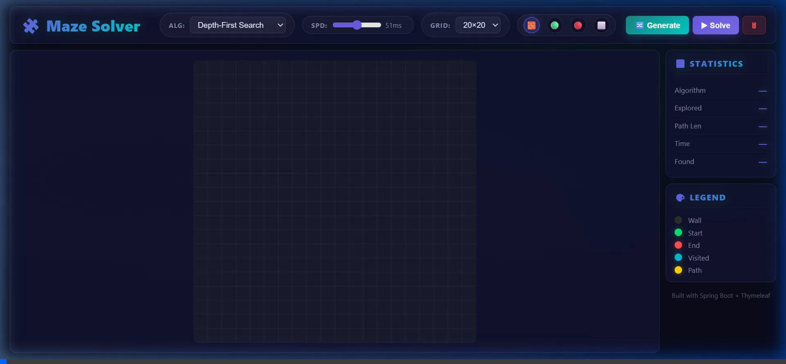
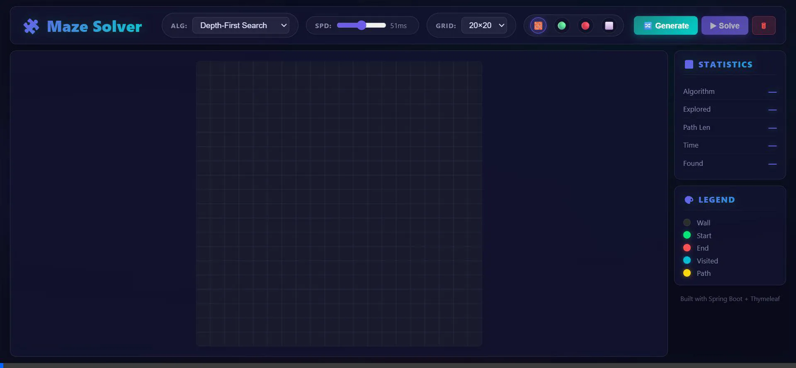

# Maze Solver Visualizer

A web app that visualizes pathfinding algorithms (BFS, DFS, Dijkstra, A*) solving mazes in real-time. Built with Spring Boot and HTML5 Canvas.



## Features

- **4 Pathfinding Algorithms** with step-by-step animation
  - **BFS** — Breadth-First Search (shortest path in unweighted graphs)
  - **DFS** — Depth-First Search (deep exploration, non-optimal)
  - **Dijkstra** — Weighted shortest path with priority queue
  - **A*** — Heuristic search with Manhattan distance
- **Maze Generation** — Recursive Backtracker algorithm
- **Interactive Grid** — draw walls, place start/end, erase via click & drag
- **Live Stats** — nodes explored, path length, execution time
- **Multiple Grid Sizes** — 15×15 to 40×40



## Architecture

```
┌─────────────────────────────────────────┐
│              Frontend (Canvas)          │
│  grid.js → api.js → visualizer.js      │
└────────────────┬────────────────────────┘
                 │ REST API
┌────────────────▼────────────────────────┐
│           MazeController                │
│  POST /api/solve    GET /api/algorithms │
│  POST /api/generate                    │
├─────────────────────────────────────────┤
│            MazeService                  │
│  Strategy Pattern → Algorithm Registry  │
├──────────┬──────────┬──────┬────────────┤
│   BFS    │   DFS    │Dijks │   A*       │
└──────────┴──────────┴──────┴────────────┘
```


- **Strategy Pattern** — Algorithms implement a common `PathfindingAlgorithm` interface, registered by name in `MazeService`
- **MVC** — Clean separation between Controller, Service, and Model layers
- **Template Method** — Common grid traversal logic with algorithm-specific data structures (Queue vs Stack vs PriorityQueue)

## Getting Started

### Prerequisites
- **Java 17+** (tested with Java 21)

### Run Locally

```bash
# Clone the repository
git clone https://github.com/naamsanamone/maze-solver-visualizer.git
cd maze-solver-visualizer

# Start the application (Maven Wrapper included, no global Maven needed)
./mvnw spring-boot:run

# Open in browser
# http://localhost:8080
```

### Run Tests

```bash
./mvnw test
# 30 tests: 19 algorithm + 6 generator + 5 integration
```

## Algorithm Comparison

| Algorithm | Optimal? | Data Structure | Time Complexity | Best For |
|-----------|----------|---------------|----------------|----------|
| BFS | ✅ Yes | Queue | O(V + E) | Unweighted shortest path |
| DFS | ❌ No | Stack | O(V + E) | Deep exploration, maze generation |
| Dijkstra | ✅ Yes | PriorityQueue | O((V+E) log V) | Weighted shortest path |
| A* | ✅ Yes | PriorityQueue | O((V+E) log V) | Guided optimal search |

## Tech Stack

| Layer | Technology |
|-------|-----------|
| Backend | Java 17+, Spring Boot 3.2.5 |
| Frontend | HTML5 Canvas, Vanilla JavaScript, CSS |
| Build | Maven (Wrapper included) |
| Templating | Thymeleaf |
| Testing | JUnit 5, MockMvc |

## Project Structure

```
src/main/java/com/maze/
├── MazeApplication.java          # Spring Boot entry point
├── algorithm/
│   ├── PathfindingAlgorithm.java # Strategy interface
│   ├── BFS.java                  # Breadth-First Search
│   ├── DFS.java                  # Depth-First Search
│   ├── Dijkstra.java             # Dijkstra's Algorithm
│   └── AStar.java                # A* Search
├── generator/
│   ├── MazeGenerator.java        # Generator interface
│   └── RecursiveBacktracker.java # Randomized DFS maze generator
├── model/
│   ├── Cell.java                 # Grid cell (row, col, type)
│   ├── CellType.java             # EMPTY, WALL, START, END
│   ├── Grid.java                 # 2D cell array with helpers
│   ├── SolveRequest.java         # API request payload
│   └── SolveResult.java          # API response (path + visited order)
├── controller/
│   └── MazeController.java       # REST endpoints + error handling
└── service/
    └── MazeService.java          # Algorithm registry + delegation

src/main/resources/
├── static/
│   ├── css/style.css             # Dark theme styles
│   └── js/
│       ├── grid.js               # Canvas grid rendering + interaction
│       ├── api.js                # REST API client
│       ├── visualizer.js         # Animation engine
│       └── app.js                # Main application logic
└── templates/
    └── index.html                # Thymeleaf page

src/test/java/com/maze/
├── algorithm/PathfindingAlgorithmTest.java    # 19 unit tests
├── generator/RecursiveBacktrackerTest.java    # 6 unit tests
└── controller/MazeControllerIntegrationTest.java  # 5 integration tests
```

## API Reference

| Method | Endpoint | Description |
|--------|----------|-------------|
| `GET` | `/` | Main visualizer page |
| `GET` | `/api/algorithms` | List available algorithms |
| `POST` | `/api/solve` | Solve maze (JSON body: grid + algorithm + start/end) |
| `POST` | `/api/generate?rows=N&cols=N` | Generate random maze |

## License

This project is open source and available under the [MIT License](LICENSE).
